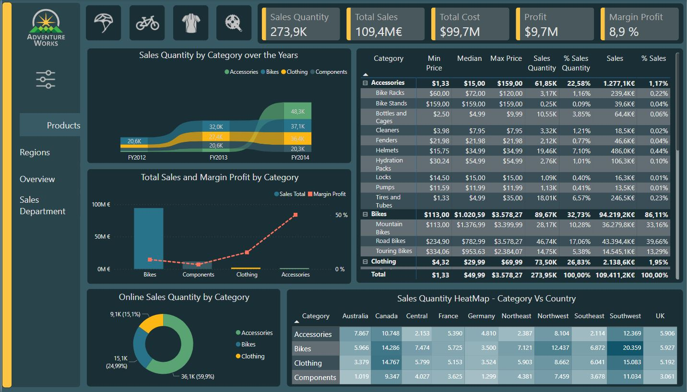
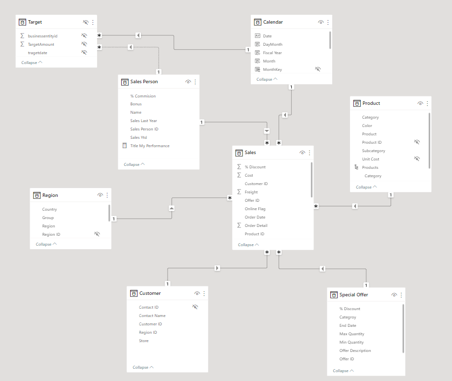

# AdvendutreWorks Sales Analysis 
AdventureWorks Sales Analysis project repository (created 02/07/23)

### [Here you can interact with the dashboard](https://app.powerbi.com/view?r=eyJrIjoiNjJlY2ZkZDQtY2EwYS00NWVlLTliODktM2ViMzg2OTQ3OGJkIiwidCI6Ijk5YTVhNjM1LTY1OGEtNGFhMS04MGIxLTdiM2IwNzcxZTkxYiIsImMiOjl9)

The objective of this project is to create an end-to-end sales analytic report based on AdventureWorks database. Which is an online transaction processing (OLAP) database sample based on a fictitious multinational bicycle manufacturing company named AdventureWorks. 
This database was created by Microsoft in order to show how to design a SQL Server Database.

The implementation of this project has involved the following steps:

## Collecting the Data:
AdventureWorks OLAP database sample is available to download [here](https://github.com/microsoft/sql-server-samples/tree/master/samples/databases/adventure-works), where it provides information to restore or create it as SQL Server database. 
 
## Creating the Database:
This github [repository](https://github.com/lorint/AdventureWorks-for-Postgres) (by _@lorint_) provides all the scripts and information necessary to create a PostgreSQL database with AdventureWorks sample.
There are two options to create the DB: 
The first one creates the DB on the local computer by running a ruby file to convert CSV’s into a format usable by PostgreSQL, as well as a PostgreSQL script to create the tables, load the data, add primary and foreign keys, and create some of the views used by AdventureWorks.
The second one takes the same method but deploys it with docker-compose to create the PostgreSQL DB in a container.
Both methods were tested but the rest of the project follows the first one. 
The result is a DB with 68 tables containing HR, sales, product, and purchasing data organized across 5 schemes with 300 employees, 500 products, 20000 customers and 31000 sales with 121.300 lines items from 2011 to 2014.

## Data Filtering:
The initial requirement is to filter this amount of data in order to import into the analytic tool only a collection of data prepared for modeling.
At this moment it is important to look into the existing DB schemes to understand how the data is structured using database management platforms like pgAdmin and DBeaver. These tools allow to write SQL queries to extract relevant data from the DB. Queries that also enable to organize the data in tables in order to start data modeling. 
 
## Data Cleaning:
Working with OLTP DB makes the data cleaning easier than having raw data instead, even so it is necessary to choose feature names and set data format.

## Data Modeling:
From here Power BI Desktop will be used to complete next stages. 
At this point it is required to import the data from PostgreSQL DB with an SQL statement within the specific connection available in Power BI. Connection that allows defining data filtering and data cleaning by applying the SQL queries created in previous stages.
The data model used in this project is star schema with a unique fact table and multiple dimensions tables.
In this case there is a query for each imported table obtaining the following schema:
Fact table: Sales
Dimensions tables: Sales Person, Region, Product, Customer, Special Offer

Each dimension table it’s related to the fact table (one-to-many relationship)
During data modeling process it’s necessary to create a date table (Calendar table) to make calculations based on date.

## Creating DAX Measures
Building a complete set of DAX measures allows to gain insight from the data and built more complex visualizations.
    
## Creating Visualizations
Exploring different variables and their relationships with each other reveals which visualizations are more appropriate to represent the information obtained from data analytic.
Once the visualizations have been created and selected, it is time to start building the dashboard.

## Building the Dashboard
Power BI provides different tools such as bookmarks, buttons, slicing, drill-through, page navigation and other techniques that can give a complete view of the insights found in the DB.

Thank you for your attention and feel free to give your feedback.

