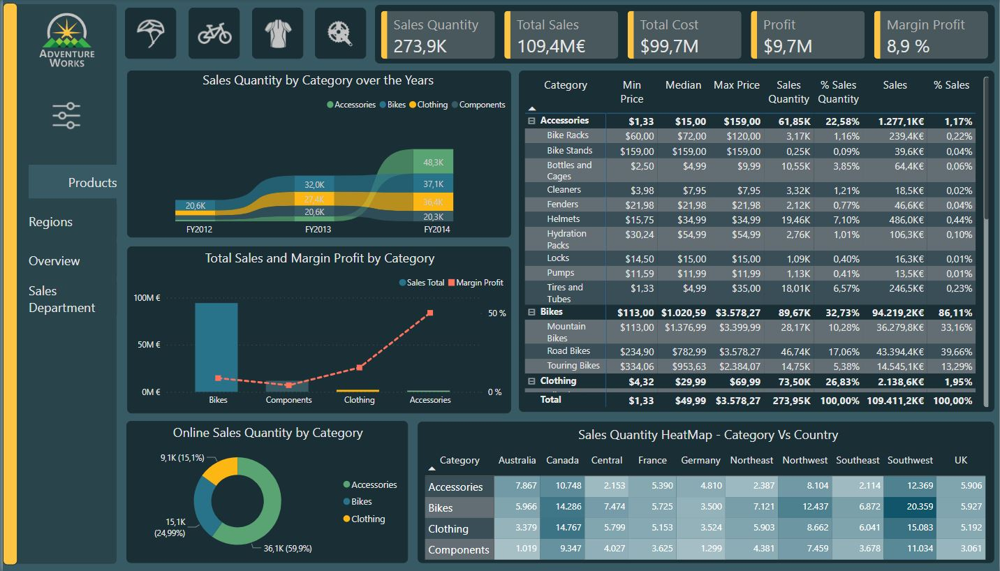
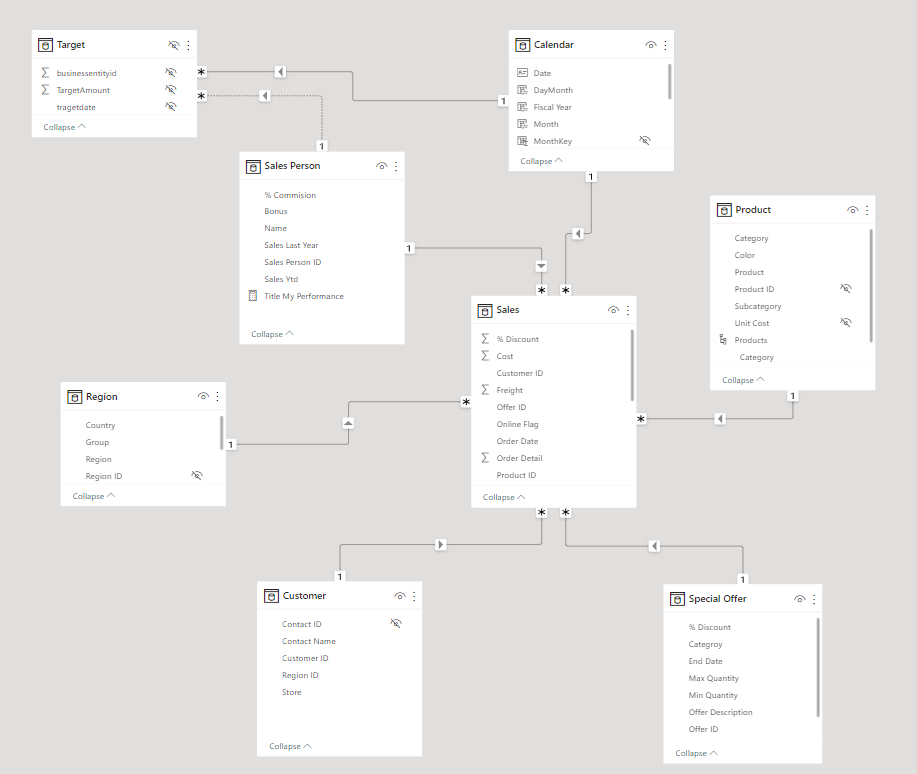

# 🛒 AdventureWorks Sales Analysis

> End-to-end sales analytics report built on the AdventureWorks relational database —
> from PostgreSQL source to star schema data model to interactive Power BI dashboard.

[](https://app.powerbi.com/view?r=eyJrIjoiNjJlY2ZkZDQtY2EwYS00NWVlLTliODktM2ViMzg2OTQ3OGJkIiwidCI6Ijk5YTVhNjM1LTY1OGEtNGFhMS04MGIxLTdiM2IwNzcxZTkxYiIsImMiOjl9)



---

## 🎯 Project Overview

Sales analytics report based on **AdventureWorks** — Microsoft's sample OLTP database
modelling a fictitious multinational bicycle manufacturer. The database spans 2011–2014
and contains 300 employees, 500 products, 20,000 customers and 31,000 sales orders
across 5 database schemas.

**Goal:** transform a complex relational OLTP database into a clean, performant
analytical model with actionable sales insights.

---

## 🔄 Project Workflow

### 1 · Database Setup
AdventureWorks deployed as a **PostgreSQL** database using
[@lorint's scripts](https://github.com/lorint/AdventureWorks-for-Postgres) —
available via local install or Docker Compose.

- 68 tables across 5 schemas (HR, Sales, Product, Purchasing, Person)
- Explored with **pgAdmin** and **DBeaver** to map relationships

### 2 · Data Filtering & Cleaning
SQL queries written to extract only the tables and columns needed for analysis,
applied directly at the Power BI connection level to avoid importing unnecessary data.

- Selected relevant fields from sales, product, customer and territory schemas
- Standardised column names and data types
- OLTP source minimised the need for heavy cleaning

### 3 · Data Model — Star Schema

Power BI connects to PostgreSQL via native connector, applying the SQL filters on import.
```
Fact Table:      Sales
Dimensions:      Sales Person · Region · Product · Customer · Special Offer · Calendar
```



All dimension tables relate to the fact table via **one-to-many** relationships.
A dedicated **Calendar table** enables time intelligence calculations.

### 4 · DAX Measures
Complete set of measures built to power the report:

- Revenue, profit margin, order volume
- YoY growth, MTD / YTD comparisons
- Top N products and customers
- Sales rep performance tracking

### 5 · Dashboard
Interactive Power BI report using bookmarks, drill-through, slicers and page navigation
for a complete view of sales performance across products, regions and time.

---

## 📊 Key Insights Covered

- Revenue and margin trends by year, quarter and month
- Top performing products, categories and subcategories
- Regional sales breakdown and territory performance
- Customer segmentation and purchasing behaviour
- Sales team individual performance

---

## 🛠️ Tech Stack


---

## 📁 Repository Structure
```
AdventureWorks_Analysis/
├── sql/        # SQL queries — data filtering and extraction
├── images/     # Dashboard screenshots and data model diagram
└── README.md
```

---

## 📫 Contact

[](https://www.linkedin.com/in/jose-maria-sancho-navarro/)
[](https://linktr.ee/xemasancho)
[](mailto:xemasancho@gmail.com)
